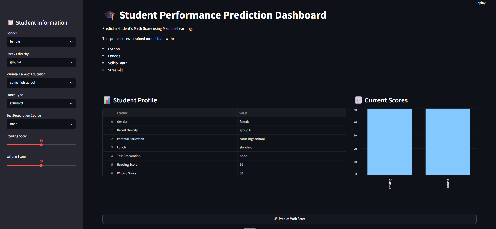
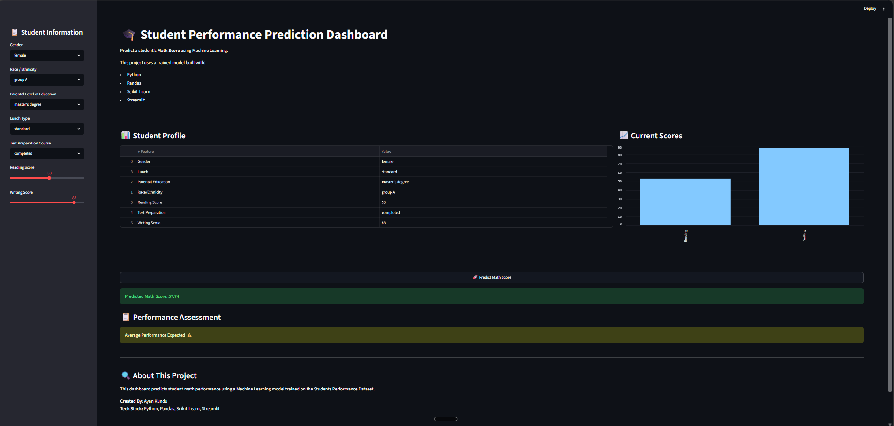

# 🎓 Student Performance Predictor

A Machine Learning-powered web application that predicts a student's **Math Score** based on academic and demographic factors.

---

## 🌐 Live Demo

🚀 Try the application here:

👉 https://student-performance-predictor-ayan.streamlit.app/

---

## 📌 Project Overview

Educational institutions often need to understand factors affecting student performance.

This project uses Machine Learning to predict a student's Math Score using:

- Gender
- Race/Ethnicity
- Parental Level of Education
- Lunch Type
- Test Preparation Course
- Reading Score
- Writing Score

The model is trained on the popular Students Performance Dataset and deployed using Streamlit Cloud.

---

## 📷 Application Preview

<p align="center">
  
</p>

<p align="center">
  
</p>

---

## 🚀 Features

✅ Interactive Streamlit Dashboard

✅ Real-Time Math Score Prediction

✅ User-Friendly Interface

✅ Machine Learning Powered

✅ Cloud Deployment

✅ Open Source

---

## 🗂️ Dataset Information

Dataset: Students Performance Dataset

Target Variable:

```text
math score
```

Input Features:

```text
gender
race/ethnicity
parental level of education
lunch
test preparation course
reading score
writing score
```

Dataset Size:

```text
Rows: 1000
Columns: 8
```

---

## ⚙️ Machine Learning Workflow

### Phase 1: Problem Understanding

Understanding factors affecting student academic performance.

### Phase 2: Data Collection

Collected dataset from Kaggle.

### Phase 3: Data Cleaning

- Missing Value Analysis
- Duplicate Check
- Data Validation

### Phase 4: Exploratory Data Analysis

- Distribution Analysis
- Correlation Analysis
- Outlier Detection

### Phase 5: Feature Engineering

- One-Hot Encoding
- Feature Selection
- Data Preparation

### Phase 6: Model Selection

Models evaluated:

- Linear Regression
- Decision Tree Regressor
- Random Forest Regressor

### Phase 7: Model Training

Training and validation of candidate models.

### Phase 8: Model Evaluation

Evaluation Metrics:

- MAE
- MSE
- RMSE
- R² Score

### Phase 9: Optimization

Hyperparameter tuning and model refinement.

### Phase 10: Deployment

Deployment using:

- Streamlit
- GitHub
- Streamlit Cloud

---

## 🛠️ Tech Stack

### Programming Language

- Python

### Data Analysis

- Pandas
- NumPy

### Machine Learning

- Scikit-Learn
- Joblib

### Visualization

- Matplotlib
- Seaborn

### Deployment

- Streamlit
- GitHub
- Streamlit Cloud

---

## 📁 Project Structure

```text
student-performance-prediction/
│
├── app.py
├── requirements.txt
├── README.md
│
├── models/
│   ├── student_score_predictor.pkl
│   └── feature_columns.pkl
│
├── src/
│   └── dashboard.png
│
└── notebook/
```

---

## 💻 Installation

Clone the repository:

```bash
git clone https://github.com/ayankunduixb-pixel/student-performance-prediction.git
```

Move into project directory:

```bash
cd student-performance-prediction
```

Install dependencies:

```bash
pip install -r requirements.txt
```

Run the application:

```bash
streamlit run app.py
```

---

## 🎯 Future Enhancements

- Advanced Dashboard UI
- Feature Importance Visualization
- Explainable AI (SHAP)
- Student Performance Reports
- Multiple Model Comparison
- Docker Deployment
- AWS Deployment

---

## 📈 Learning Outcomes

Through this project, I learned:

- Data Cleaning
- Exploratory Data Analysis
- Feature Engineering
- Regression Algorithms
- Model Evaluation
- Streamlit Development
- Cloud Deployment
- Git & GitHub Workflow

---

## 👨‍💻 Author

### Ayan Kundu

Computer Science Student | Data Science Enthusiast

GitHub:
https://github.com/ayankunduixb-pixel

---

## ⭐ Support

If you found this project useful, consider giving it a ⭐ on GitHub.